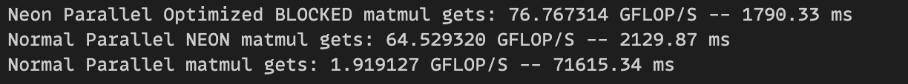

# General matrix multiplication

## Introducation
This repository contains a simple implementation of matrix multiplication using OpenMP and the NEON instruction set. The goal is to demonstrate the use of parallel processing and optimized instructions for matrix operations.

## Requirements
1. A compatible ARM-based processor with NEON support
2. OpenMP installed and configured on your system
3. A C compiler (e.g., GCC/CLANG)

### Compiliation
To compile the code, use the following command:
```bash
 gcc -o gemm gemm.c  -O3 -ffast-math -fopenmp
```

## Performance progress
This benchmark was run on an M2 Pro processor.


> [!NOTE] 
>
> The code demonstrates the effectiveness of vectorized operations and the utilization of blocked matrix multiplication for enhanced performance.